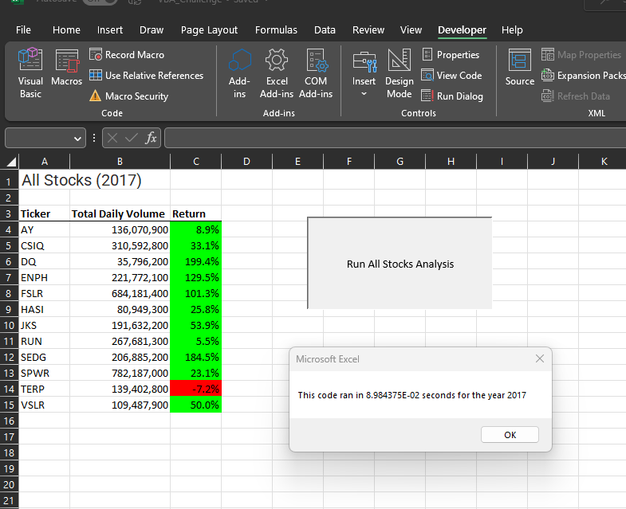
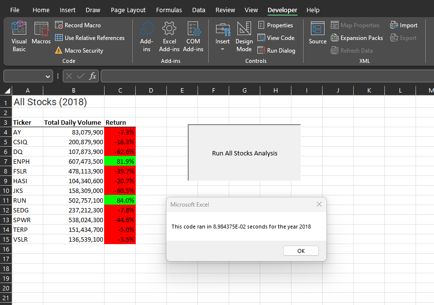

# Stock Analysis (VBA)

## Project Overview
Using VBA it is possible to analyze data for seperate sheets by running macros that specify what information to pull.

## Results

If 2017 us entered after pressing the botton this is will be the analysis shown. In 2017 the market as a whole did well and the chosen stocks went up in value. 

With the 2018 input we can see the information for that year. Here we see all stocks are down and the only two to actually return value are ENPH and RUN.

Previously the scripts were not refined so it took a while to run but now as its been refractored you can see that both years run almsot instantly.

## Summary
### Advantages and disadvantages for refactoring code in General:

#### Advantages

Is cleaner

Can improve processing time

#### Disadvantages 

Takes time to do

Can be confusing if you are not the original code creator. 

### The advantages and disadvantages for refactoring of the original VBA script

#### Advantages
Better performance

Cleaner data with formatting

#### Disadvantages 
Will be confusing for someone to edit

Took time to find solutions for better run times.

